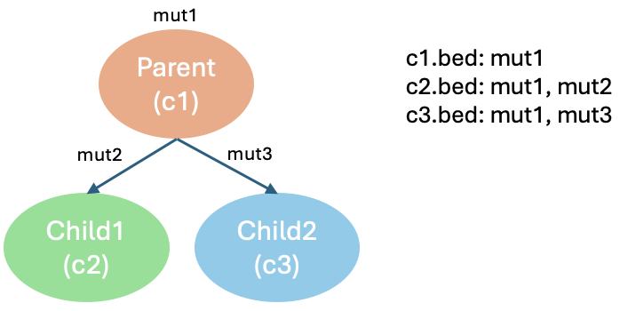

<!-- README.md is generated from README.Rmd. Please edit that file -->

```{r, include = FALSE}
knitr::opts_chunk$set(
  collapse = TRUE,
  comment = "#>",
  fig.path = "man/figures/README-",
  out.width = "100%"
)
```

# SVCFit

<!-- badges: start -->

<!-- badges: end -->

SVCFit is a fast and scalable computational tool developed to estimate the structural variant cellular fraction (SVCF) of inversions, deletions and tandem duplications without using tumor sample purity. The SVCF can be used to assign these structural variants to tumor clones and/or place them on a tumor evolutionary tree.

## Installation

You can install SVCFit from [GitHub](https://github.com/) with:

``` r
# install.packages("pak")
pak::pak("KarchinLab/SVCFit")
```

## Dependency

``` r
# install.packages("tidyverse")
library(tidyverse)
```

## Input your structural variants into SVCFit

The input should be in Variant Call Format (VCF) as outputed by the Manta package [1]. If you have a VCF output from a structural variant caller other than Manta, you can modify it to match Manta format.

| CHROM  | POS  | ID                          | REF  | ALT   | QUAL | FILTER | INFO                                    | FORMAT  | tumor           |
|--------|------|-----------------------------|------|-------|------|--------|-----------------------------------------|---------|----------------|
| chr1   | 1000 | MantaINV:6:0:1:0:0:0        | T    | <INV> | .    | PASS   | END=1500;SVTYPE=INV;SVLEN=500          | PR:SR   | 20,30:19,27    |
| chr2   | 5000 | MantaDEL:7:0:1:0:0:0        | G    | <DEL> | .    | PASS   | END=5300;SVTYPE=DEL;SVLEN=300          | PR      | 15,30          |


## General workflow

*SVCF()* is the main function in this package that wraps all functionality described below. All functions can also be run separately.

``` r
SVCF(vcf_path="~/path/to/file.vcf", tumor_only=FALSE, length_threshold=0, overlap=TRUE, tolerance=6, window=100, multiple=FALSE, truth_path=NULL, mode="heritage")
```

*SVCF()* requires two arguments and includes several optional parameters:

### Required Arguments  

| Argument     | Type      | Default | Description |
|-------------|----------|-------------|-------------|
| `vcf_path`  | Character | `NULL` | Path to VCF files. |
| `tumor_only` | Boolean  | `FALSE` | Whether the VCF is created without a matched normal sample. |

### Optional Arguments  

| Argument          | Type       | Default | Description |
|------------------|-----------|---------|-------------|
| `length_threshold` | Integer   | `0`     | Structural variant length filter threshold. |
| `overlap`        | Boolean   | `FALSE` | Whether structural variants should be filtered based on coordinate overlap. |
| `tolerance`      | Integer   | `6`     | Maximum distance between structural variants to be considered as a single variant. |
| `window`         | Integer   | `1000`  | Number of structural variants checked for overlap to form a single variant. |
| `multiple`       | Boolean   | `FALSE` | Whether the sample has multiple clones (used in simulated data for assigning clones). |
| `truth_path`     | Character | `NULL`  | Path to BED files storing true structural variant information with clonal assignment. Each BED file should be named like `"c1.bed, c2.bed"`, etc. Structural variants should be saved in separate BED files if they belong to different (sub)clones. |
| `mode`           | Character | `"heritage"` | Describes how true clonal information is saved:<br>- **`"heritage"`**: BED files for child clones contain all ancestral structural variants of their parents.<br>- **`"separate"`**: Child clones do not contain any ancestral structural variants. |

The steps executed by *SVCF()* are:

### 1. Extract information from input VCF (*extract_info()*)

This step assigns column names and extracts key information for downstream calculation and filtering. Key information includes reads, structural variant length, and structural variant coordinates.

This function has 3 arguments:

| Argument           | Type      | Default | Description |
|-------------------|----------|---------|-------------|
| `vcf_path`       | Character | `NULL`     | Path to VCF files. |
| `tumor_only`     | Boolean   | `FALSE`     | Whether the VCF is created without a matched normal sample. |
| `length_threshold` | Numeric  | `0`     | Structural variant length filter threshold. |

For example, the following command will generate an annotated VCF file with all structural variants with length\>50

``` r
vcf <- extract_info("~/path/to/file.vcf", tumor_only=TRUE, length_threshold=50)
```

The output from *extract_info()* will be in annotated VCF format.

### 2. Check overlapping structural variants (*check_overlap()*)

This step checks if structural variants are close enough to be considered as a single structural variant.

This function has 4 arguments:

| Argument   | Type      | Default | Description |
|-----------|----------|---------|-------------|
| `dat`      | DataFrame | N/A     | A dataframe to be compared. |
| `compare`  | DataFrame | N/A     | A dataframe used as a reference for comparison. |
| `tolerance` | Integer  | `6`     | Threshold for the maximum distance between structural variants to be considered as a single variant. |
| `window`   | Integer  | `1000`  | Number of structural variants checked for overlap to form a single variant. |

Note: When *dat* and *compare* are the same dataframe, this function will merge overlapping structural variants and recompute the reads supporting the new structural variant by taking the average of the overlapping structural variants. When *compare* is the ground truth from a simulation, this function will also remove false positive structural variants that were not included in the simulation.

``` r
checked <- check_overlap(dat, compare)
```

### 3. Calculate SVCF for structural variants (*calculate_svcf()*)

This step calculates the structural variant cellular fraction (SVCF) for all structural variants in the input VCF file.

``` r
output <- calculate_svcf(input=checked, tumor_only=FALSE)
```
This function has 2 arguments:

| Argument   | Type      | Default | Description |
|-----------|----------|---------|-------------|
| `dat`      | DataFrame | N/A     | It stores the set of information for structural variants used to calculate SVCF. |
| `tumor_only` | Boolean  | `FALSE` | Whether the VCF is created without a matched normal sample. |

The output is an annotated VCF with additional fields for VAF, Rbar, r and SVCF. VAF=variant allele frequency; Rbar=average break interval count in a sample; r = inferred integer copy number of break intervals; SVCF=structural variant cellular fraction.

### 4. Additional functions

*attach_clone* and *read_clone* are functions to assign structural variants to tumor clones, when the assignment is known.

4.1 read clonal assignment

``` r
truth <- read_clone(truth_path, mode="heritage")
```

This function has 2 arguments:

| Argument      | Type      | Default | Description |
|--------------|----------|-------------|-------------|
| `truth_path` | Character | N/A | Path to BED files storing true structural variant information with clonal assignment. Each BED file should be named like `"c1.bed, c2.bed"`, etc. Structural variants should be saved in separate BED files if they belong to different (sub)clones. |
| `mode`       | Character | `heritage` | Describes how true clonal information is saved:<br>- **`"heritage"`**: BED files for child clones contain all ancestral structural variants of their parents.<br>- **`"separate"`**: Child clones do not contain any ancestral structural variants. |


The file path should follow this structure:

``` r
root/
├── true_clone/
│   ├── c1.bed/
│   ├── c2.bed/
│   ├── c3.bed/
│   └── .../
```

Following the tree on the left, variants contaibed in bed files under two modes should be:

{width="487"}

4.2 attach clonal assignment to structural variants

``` r
attched <- attach_clone(dat, truth, tolerance = 6)
```

This function has 3 arguments:

| Variable   | Type      | Default | Description |
|------------|----------|-------------|-----------|
| `dat`      | DataFrame | N/A | Stores structural variants for clone assignment. |
| `truth`    | DataFrame | N/A | Stores the clone assignment for each structural variant designed in a simulation. |
| `tolerance` | Integer  | `6` | Sets the threshold for the maximum distance between structural variants to be considered as a single structural variant when assigning clones. |

## Tutorial

``` r
library(SVCFit)
vignette("SVCFit_guide", package = "SVCFit")
```

## Data availability

This repository contains source code used to produce figures for SVCFit publication under Paper folder. All data can be downloaded from [Mendeley](https://data.mendeley.com) to reproduce figures by searching "SVCFit benchmark dataset".

## Reference

1.  Chen, X. et al. (2016) Manta: rapid detection of structural variants and indels for germline and cancer sequencing applications. Bioinformatics, 32, 1220-1222. <doi:10.1093/bioinformatics/btv710>
