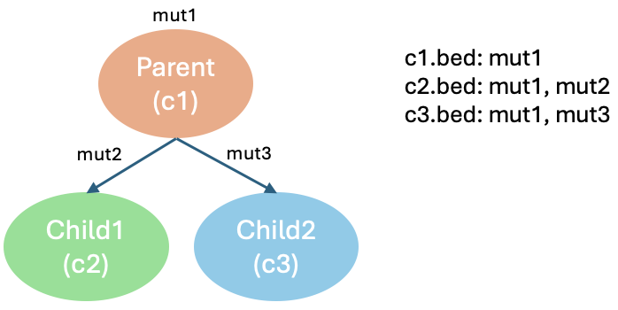

<!-- README.md is generated from README.Rmd. Please edit that file -->

```{r, include = FALSE}
knitr::opts_chunk$set(
  collapse = TRUE,
  comment = "#>",
  fig.path = "man/figures/README-",
  out.width = "100%"
)
```

# SVCFit 

SVCFit is a fast and scalable computational tool designed to estimate the Structural Variant Cellular Fraction (SVCF) of inversions, deletions, tandem duplications, and translocations. Developed for the R environment, SVCFit integrates structural variant (SV) calls with Copy Number Variation (CNV) and Single Nucleotide Polymorphism (SNP) data to provide accurate cellular fraction estimates.

**Resources**

-   Open access data: It is available on mendeley (doi: 10.17632/2nhhdjx225.3)

-   Protected Data: Available via European Genome-phenome Archive (EGAD00001001343).

-   Prostate mixture scripts: [GitHub Repository](https://github.com/mcmero/SVclone_Rmarkdown/blob/master/make_insilico_mixtures.sh)

## Installation

SVCFit is hosted on GitHub. You can install it directly within R using the `remotes` package.

**Note:** Installation requires a GitHub Personal Access Token (PAT) because the repository is hosted on GitHub.\\.

``` r
if (!requireNamespace("remotes", quietly = TRUE))
    install.packages("remotes")

# 1. Setup GitHub Credentials (if not already configured)
if (!requireNamespace("usethis", quietly = TRUE))
    install.packages("usethis")

# Create a token in your browser
usethis::create_github_token() 

# Store the token (paste when prompted)
credentials::set_github_pat()

# 2. Install SVCFit
remotes::install_github("KarchinLab/SVCFit", build_vignettes = TRUE, dependencies = TRUE)
```

## Input Requirements

### 1. Structural variants

SVCFit accepts standard Variant Call Format (VCF) files. By default, the parser is optimized for VCFs produced by the SVTyper package [2].

| CHROM | POS | ID | REF | ALT | QUAL | FILTER | INFO | FORMAT | normal | tumor |
|-------|-------|-------|-------|-------|-------|-------|-------|-------|-------|-------|
| chr1 | 1000 | INV:6:0:1:0:0:0 | T | <INV> | 100 | PASS | END=1500;SVTYPE=INV;SVLEN=500;... | GT:PR:SR:... | 0/1:76,0:70,0:... | 0/1:76,0:70,0:... |
| chr2 | 5000 | DEL:7:0:1:0:0:0 | G | <DEL> | 100 | PASS | END=5300;SVTYPE=DEL;SVLEN=300;... | GT:PR:SR:... | 0/1:76,0:70,0:... | 0/1:76,0:70,0:... |

Required **INFO** fields:

-   `SVTYPE` (e.g., INV, DEL, DUP, BND)
-   `END`

### 2. Copy number variants

SVCFit currently utilizes copy number calls from the FACETS package [3]. The tool uses allele-specific copy number, total copy number, and the cellular fraction (cncf) to annotate SVs with overlapping CNVs. No modification is required for standard FACETS output.

### 3. Heterozygous SNP near SV

SVCFit requires heterozygous SNP calls to phase overlapping CNVs. These can be generated using GATK4 [4] HaplotypeCaller and filtered using bcftools [5].

For computational efficiency, VCF can be filtered to include only heterozygous SNPs within 500bp of SV breakpoints.

The following code is not included in SVCFit and should be run separately.

```         
# 1. Call SNPs using GATK
gatk --java-options "-Xmx4g" HaplotypeCaller \
    -R $ref \
    -I $normal_bam \
    -O $snp_dir/SNP.vcf.gz

# 2. Filter for heterozygous SNPs using bcftools
bcftools view -v snps -g het -Oz -o $snp_dir/het_snp.vcf.gz $snp_dir/SNP.vcf.gz
tabix -p vcf $snp_dir/het_snp.vcf.gz
```

### 4. Heterozygous SNP on SV supporting reads

To infer SV phasing, SVCFit specifically examines heterozygous SNPs found on reads that support the structural variant. This is done following the steps: 1) Extract SV-supporting reads from the BAM file using samtools [6]. 2) Generate a read pileup using bcftools restricted to the heterozygous SNP positions identified in step 3.

The following code is not included in SVCFit and should be run separately.

```         
# Extract SV supporting reads
samtools view -f 1 -F 2 -b $tumor_bam > $snp_dir/sup_$samp_name.bam
samtools index $snp_dir/sup_$samp_name.bam

# Generate pileup at known heterozygous sites
# Note: pos_$samp_name.bed should contain the positions from het_snp.vcf.gz above
bcftools mpileup -f $ref -a DP,AD -A \
    -R $snp_dir/pos_$samp_name.bed \
    $snp_dir/sup_$samp_name.bam -Ov > $snp_dir/het_on_sv_$samp_name.vcf
```

## Usage Workflow

The SVCFit pipeline consists of three main steps: **Extraction**, **Characterization**, and **Calculation**.

### 1. Extract SV and SNP Information — `extract_info()`

Load and preprocess input VCF and CNV files. This step parses metadata, processes breakends (BND), and handles heterozygous SNPs. `extract_info()` internally performs:

1.  **Load input data** — `load_data()`
2.  **Process BND events** — `proc_bnd()`
3.  **Parse SV metadata** — `parse_sv_info()`
4.  **Parse heterozygous SNPs** — `parse_het_snp()`, `parse_snp_on_sv()`

``` r
info <- extract_info(
  p_het = "path/to/het_snps.vcf",
  p_onsv = "path/to/snps_on_sv.vcf",
  p_sv = "path/to/structural_variants.vcf",
  p_cnv = "path/to/cnv_file.txt",
  chr_lst = NULL,
  flank_del = 50, 
  QUAL_tresh = 100, 
  min_alt = 2, 
  tumor_only = FALSE
)
```

#### Function Arguments

#### `extract_info()`

| Argument | Type | Default | Description |
|------------------|------------------|------------------|------------------|
| `p_het` | Character | — | Path to VCF of heterozygous SNPs. |
| `p_onsv` | Character | — | Path to VCF of SNPs overlapping SV-supporting reads. |
| `p_sv` | Character | — | Path to SV VCF. |
| `p_cnv` | Character | — | Path to CNV file. |
| `chr_lst` | Character | NULL | Chromosomes to include. |
| `flank_del` | numeric | 50 | Max distance to consider deletion overlapping a BND. |
| `QUAL_tresh` | numeric | 100 | Minimum QUAL score. |
| `min_alt` | numeric | 2 | Minimum alternative reads. |
| `tumor_only` | Logical | FALSE | Whether SVs come from tumor-only calling. |

**Output:** A list of data frames containing parsed SV + SNP information.

### 2. Annotate SVs Using CNV and SNP Information — `characterize_sv()`

This step integrates CNV and heterozygous SNPs to infer phasing, zygosity, and overlapping CNV. `characterize_sv()` internally performs:

1.  **Assign SV IDs to SNPs** — `assign_svids()`
2.  **Summarizes phasing + zygosity** — `sum_sv_info()`
3.  **Assign CNV to SV** — `assign_cnv()`
4.  **Annotate overlapping CNV** — `annotate_cnv()`, `parse_snp_on_sv()`

``` r
sv_char <- characterize_sv(
  sv_phase = info$sv_phase, 
  sv_info = info$sv_info, 
  cnv = info$cnv,
  flank_snp = 500,
  flank_cnv = 1000
)
```

#### Function Arguments

#### `characterize_sv()`

| Argument    | Type       | Default | Description                       |
|-------------|------------|---------|-----------------------------------|
| `sv_phase`  | data.frame | —       | Phasing/zygosity from SNPs.       |
| `sv_info`   | data.frame | —       | Parsed SV metadata.               |
| `cnv`       | data.frame | —       | CNV data.                         |
| `flank_snp` | numeric    | 500     | Max assignment distance for SNPs. |
| `flank_cnv` | numeric    | 1000    | Max assignment distance for CNVs. |

### 3. Calculate SVCF for Structural Variants — `calculate_svcf()`

This step computes the **Structural Variant Cellular Fraction (SVCF)**. and returns an annotated VCF file in data.frame format.

``` r

svcf_out <- calculate_svcf(
  anno_sv_cnv = sv_char$anno_sv_cnv,
  sv_info     = sv_char$sv_info,
  thresh      = 0.1,
  samp        = "SampleID",
  exper       = "ExperimentID"
)
```

#### Function Arguments

| Argument      | Type       | Default | Description                            |
|-----------------|-----------------|-----------------|---------------------|
| `anno_sv_cnv` | data.frame | —       | CNV-annotated SVs.                     |
| `sv_info`     | data.frame | —       | Parsed SV info.                        |
| `thresh`      | numeric    | 0.1     | Threshold for SV-before-CNV inference. |
| `samp`        | character  | —       | Sample name.                           |
| `exper`       | character  | —       | Experiment name.                       |

**Output:** An annotated VCF-like data frame with additional fields for VAF, Rbar, r, and SVCF.

1.  VAF: variant allele frequency
2.  Rbar: average break interval count in a sample
3.  r: inferred integer copy number of break intervals
4.  SVCF: structural variant cellular fraction.

### 4. Build tumor evolution tree — `build_tree()`

This step build the tumor evolutionary tree based on SV clusters obtained from Dirichlet process Gaussian Mixture Model (DP-GMM).Currently, this step is optimized for two sample longitudinal data.

``` r
output <- cluster_data(
  pair_path, 
  pur_path, 
  pair=1)
clone2=output[[3]]

build_tree(
  clones,
  lineage_precedence_thresh=0.2, 
  sum_filter_thresh=0.2)
```

#### Function Arguments

cluster_data()

| Argument | Type | Default | Description |
|------------------|------------------|------------------|------------------|
| `pair_path` | character | — | Path to a tab-separated file with columns for 'pre_BAT sample' and 'on_BAT sample'. |
| `pur_path` | character | \- | Path to a tab-separated file with columns for 'sample' and 'purity'. |
| `pair` | numeric | 1 | The identifier (index or ID) for the specific sample pair (patient) being analyzed. |

build_tree()

| Argument | Type | Default | Description |
|------------------|------------------|------------------|------------------|
| `clones` | data.frame | — | SV clustering result. |
| `lineage_precedence_thresh` | numeric | 0.2 | Maximum violation of lineage precedence rule. |
| `sum_filter_thresh` | numeric | 0.2 | Maximum violation of sum condition rule |

**Output:** A tumor evolutionary tree rooted at the germline (G). Node numbers correspond to SV cluster numbers. The branching depicts the chronological occurrence of SV clusters.

### 5. Simulation & Benchmarking

SVCFit includes utility functions for processing simulation data from VISOR and attaching "ground truth" labels to structural variants for benchmarking.

5.1 read clonal assignment

``` r
truth <- load_truth(
  truth_path = "path/to/truth_beds", 
  overlap = FALSE
  )
```

This function has 1 arguments:

| Argument | Type | Default | Description |
|------------------|------------------|------------------|------------------|
| `truth_path` | Character | N/A | Path to BED files storing true structural variant information with clonal assignment. Each BED file should be named like `"c1.bed, c2.bed"`, etc for non-overlapping simulations and `"c11.bed, c22.bed"`, etc for overlapping simulations. Structural variants should be saved in separate BED files if they belong to different (sub)clones. |
| `overlap` | Logical | FALSE | Whether the simulation has SV-CNV overlap. |

The file path should follow this structure:

``` r
root/
├── true_clone/
│   ├── c1.bed/
│   ├── c2.bed/
│   ├── c3.bed/
│   └── .../
```

Parent nodes should always have lower number in name than its children (i.e. c1.bed instead of c3.bed) and all child node bed file should conatin its ancestors mutations.

{width="487"}

5.2 attach clonal assignment to output

``` r
svcf_truth <- attach_truth(svcf_out, truth)
```

This function has 3 arguments:

| Variable | Type | Default | Description |
|------------------|------------------|------------------|------------------|
| `svcf_out` | DataFrame | N/A | The output from `calc_svcf` |
| `truth` | DataFrame | N/A | Stores the clone assignment for each structural variant designed in a simulation. |

This appends the known clonal assignment to the calculated SVCF output for performance evaluation.

## Tutorial

``` r
library(SVCFit)
vignette("SVCFit_guide", package = "SVCFit")
```

## Reference

1.  Cmero, Marek, Yuan, Ke, Ong, Cheng Soon, Schröder, Jan, Corcoran, Niall M., Papenfuss, Tony, et al., "Inferring Structural Variant Cancer Cell Fraction," Nature Communications, 11(1) (2020), 730.
2.  Chen, X. et al. (2016) Manta: rapid detection of structural variants and indels for germline and cancer sequencing applications. Bioinformatics, 32, 1220-1222. <doi:10.1093/bioinformatics/btv710>
3.  Shen R, Seshan VE. FACETS: allele-specific copy number and clonal heterogeneity analysis tool for high-throughput DNA sequencing. Nucleic Acids Res. 2016 Sep 19;44(16):e131. doi: 10.1093/nar/gkw520. Epub 2016 Jun 7. PMID: 27270079; PMCID: PMC5027494.
4.  Auwera, Geraldine van der, and Brian D O’Connor. Genomics in the Cloud : Using Docker, GATK, and WDL in Terra. First edition. Sebastopol, CA: O’Reilly Media, 2020. Print.
5.  Li H. A statistical framework for SNP calling, mutation discovery, association mapping and population genetical parameter estimation from sequencing data. Bioinformatics. 2011 Nov 1;27(21):2987-93. doi: 10.1093/bioinformatics/btr509. Epub 2011 Sep 8. PMID: 21903627; PMCID: PMC3198575.
6.  Li, H., et al. (2009). The Sequence Alignment/Map format and SAMtools. *Bioinformatics*, Volume 25, Issue 16, August 2009, Pages 2078–2079, <https://doi.org/10.1093/bioinformatics/btp352>
