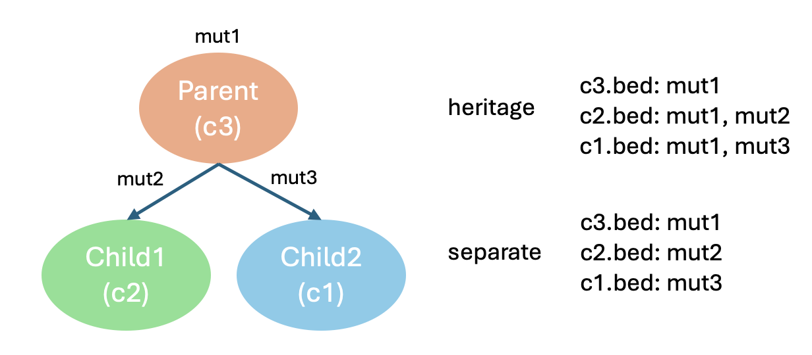

<!-- README.md is generated from README.Rmd. Please edit that file -->

```{r, include = FALSE}
knitr::opts_chunk$set(
  collapse = TRUE,
  comment = "#>",
  fig.path = "man/figures/README-",
  out.width = "100%"
)
```

# SVCFit

<!-- badges: start -->

<!-- badges: end -->

SVCFit is a fast computational tool developed to estimate the structural variant cellular fraction (SVCF) of inversions, deletions and tandem duplications. The SVCF can be used to assign these structural variants to tumor clones and/or place them on a tumor evolutionary tree.

## Installation

You can install the development version of SVCFit from [GitHub](https://github.com/) with:

``` r
# install.packages("pak")
pak::pak("KarchinLab/SVCFit")
```

## Input your structural variants into SVCFit

The input should be in Variant Call Format (VCF) as output by the Manta package (cite). If you have a VCF output from a structural variant caller other than Manta, you can modify it to match Manta format.

<!-- ```{r,echo = FALSE}  example_vcf=data.frame(CHROM=c("chr1","chr2"), POS=c(1000, 5000), ID=c("MantaINV:6:0:1:0:0:0","MantaDEL:7:0:1:0:0:0"), REF=c("T","G"), ALT=c("<INV>","<DEL>"), QUAL=c(".","."), FILTER=c("PASS","PASS"),INFO=c("END=1500;SVTYPE=INV;SVLEN=500","END=5300;SVTYPE=DEL;SVLEN=300"), FORMAT=c("PR:SR","PR"),tumor=c("20,30:19,27", "15,30")) # example_vcf #` -->

<!-- ``` -->

```         
CHROM   POS   ID    REF   ALT   QUAL    FILTER    INFO    FORMAT    tumor
chr1    1000    MantaINV:6:0:1:0:0:0    T   <INV>   .   PASS    END=1500;SVTYPE=INV;SVLEN=500   PR:SR   20,30:19,27
chr2    5000    MantaDEL:7:0:1:0:0:0    G   <DEL>   .   PASS    END=5300;SVTYPE=DEL;SVLEN=300   PR   15,30
```

## General workflow

*SVCF()* is the main function in this package that wraps all functionality described below. All functions can also be run separately.

``` r
SVCF(vcf_path="~/path/to/file.vcf", tumor_only=FALSE, length_threshold=0, overlap=TRUE, tolerance=6, window=100, multiple=FALSE, truth_path=NULL, mode="heritage")
```

*SVCF()* has 9 inputs:

1.  vcf_path: Character variable of path to vcf files.

2.  tumor_only: Boolean variable of whether the VCF is created without matched normal sample.

3.  length_threshold: Numeric variable of the structural variant length filter threshold.

4.  overlap: Boolean variable of whether a structural variants should be filtered based on coordinates overlap.

5.  tolerance: Integer variable setting the threshold for the maximum distance between structural variants to be considered as a single structural variant.

6.  window: Integer variable setting the threshold for how many structural variants should be checked for whether they overlap to form a single structural variant.

7.  multiple: Boolean variable of whether the sample has multiple clone (only used for simulated data when giving clone assignment to structural variants).

8.  truth_path: Character variable of a path to bed files storing true structural variants information with clonal assignment. Each bed file should be named like "c1.bed, c2.bed" etc. Structural variants should be saved in a seperate bed file if they belong to different (sub)clone.

9.  mode: Character variable describing how true clonal information is saved. In "heritage" mode, bed files for all children clone contains all ancestral structural variants of their parents. In "separate" mode, children clones don't contain any ancestral structural variants.

The steps executed by *SVCF()* are:

### 1. Extract information from input VCF (extract_info)

This step assigns column names and extracts key information for downstream calculation and filtering. Key information includes reads, structural variant length, and structural variant coordinates.

This function has three inputs:

1.  vcf_path: Character variable of path to vcf files.

2.  tumor_only: Boolean variable of whether the VCF is created without matched normal sample.

3.  length_threshold: Numeric variable of the structural variant length filter threshold.

For example, the following command will generate an annotated VCF file with all structural variants with length\>0

``` r
vcf <- extract_info("~/path/to/file.vcf", tumor_only=TRUE, length_threshold=0)
```

The output from *extract_info()* will be in annotated VCF format.

### 2. Check overlapping structural variants

This step checks if structural variants are close enough to be considered as a single structural variant.

This function has 4 inputs:

1.  dat: a dataframe to be compared.

2.  compare: a dataframe used as reference for comparison.

3.  tolerance: Integer variable setting the threshold for the maximum distance between structural variants to be considered as a single structural variant.

4.  window: Integer variable setting the threshold for how many structural variants should be checked for whether they overlap to form a single structural variant.

Note: When *dat* and *compare* are the same dataframe, this function will merge overlapping structural variants and recompute the reads supporting the new structural variant by taking the average of the overlapping structural variants. When *compare* is the ground truth from a simulation, this function will also remove false positive structural variants that were not included in the simulation.

``` r
checked <- check_overlap(vcf, vcf)
```

### 3. Calculate SVCF for structural variants

This step calculates the structural variant cellular fraction (SVCF) for all structural variants in the input VCF file.

``` r
output <- calculate_svcf(checked, tumor_only=FALSE)
```

The output is an annotated VCF with additional fields for VAF, Rbar, inferred ICN and SVCF. VAF=variant allele frequency; Rbar=average break interval count in a sample; inferred ICN = inferred integer copy number; SVCF=structural variant cellular fraction.

### 4. Additional functions

*attach_clone* and *read_clone* are functions to assign structural variants to tumor clones, when the assignment is known.

4.1 read clonal assignment

``` r
truth <- read_clone(truth_path, mode="heritage")
```

This function has 2 inputs:

1.  truth_path: Character variable of a path to bed files storing true structural variants information with clonal assignment. Each bed file should be named like "c1.bed, c2.bed" etc. Structural variants should be saved in a seperate bed file if they belong to different (sub)clone.

2.  mode: Character variable describing how true clonal information is saved. In "heritage" mode, bed files for all children clone contains all ancestral structural variants of their parents. In "separate" mode, children clones don't contain any ancestral structural variants.

The file path should follow this structure:

``` r
root/
├── true_clone/
│   ├── c1.bed/
│   ├── c2.bed/
│   ├── c3.bed/
│   └── .../
```

Following the tree on the left, the files under two modes should look like:

{width="487"}

4.2 attach clonal assignment to structural variants

``` r
attched <- attach_clone(dat, truth, tolerance = 6)
```

This function has 2 inputs:

1.  dat: a dataframe storing structural variants for clone assignment.

2.  truth: a dataframe storing the clone assignment for each structural variants designed in a simulation.

3.  tolerance: Integer variable setting the threshold for the maximum distance between structural variants to be considered as a single structural variant when assigning clones.

## Tutorial

``` r
library(SVCFit)
vignette("SVCFit_guide", package = "SVCFit")
```
